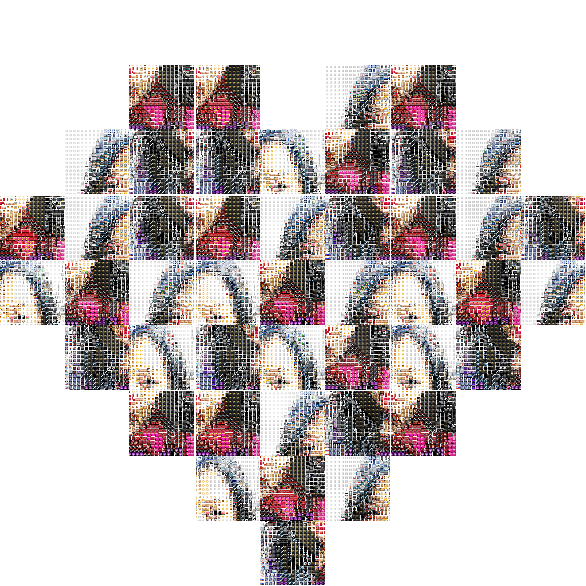
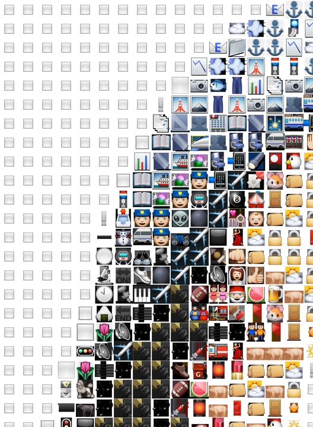
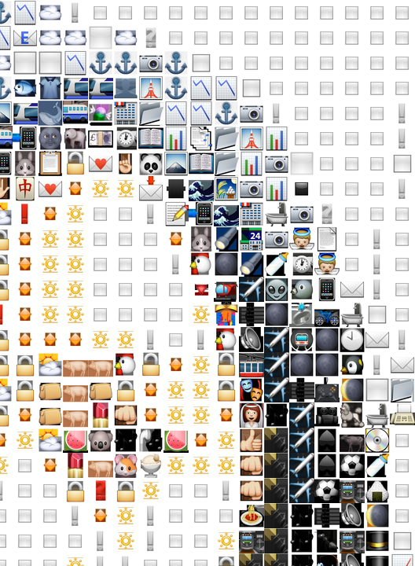
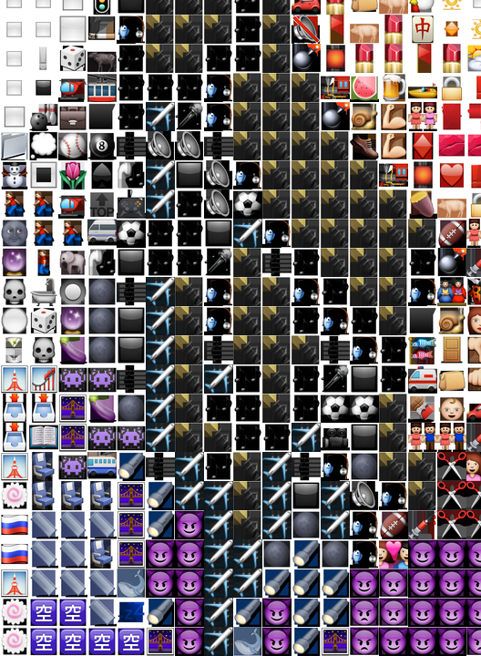
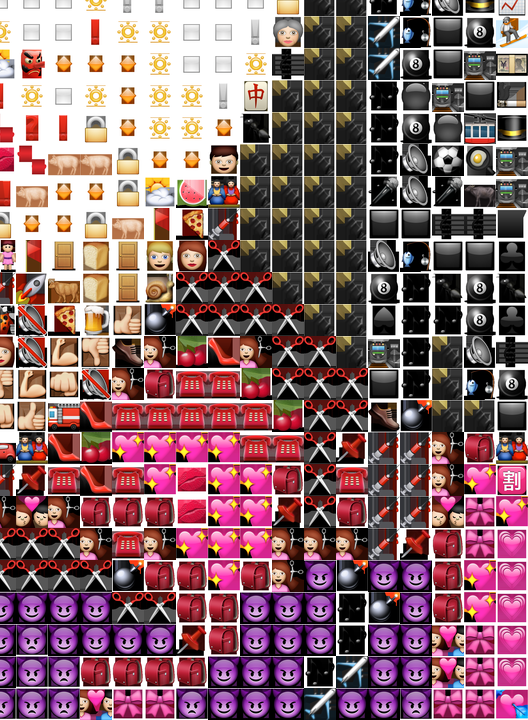
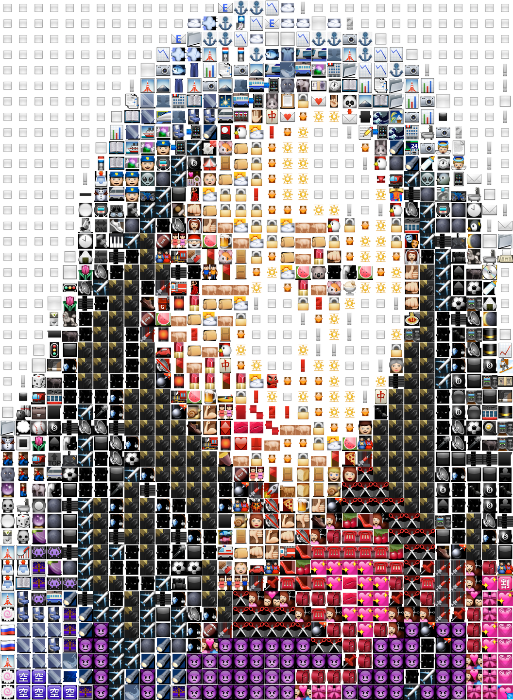

# 前言

Photo-Maker 是一个用于生成和制作各种有趣的图片脚本， 使用 Python 编写，能运行在Python2 & Python 3 之上。但均依赖 PIL 库。请自行安装。除了 PIL 之外无需引入其他依赖。


目前引入的功能有:

+ 微信朋友圈心❤️型九宫格图
+ [蒙太奇(马赛克)照片 ](https://www.wikiwand.com/zh-hans/%E7%9B%B8%E7%89%87%E9%A6%AC%E8%B3%BD%E5%85%8B)
+ 拆分图 (可以将一张图拆分为M x N 张图)
+ ASCII 图  将一张图转化为ASCII码


# 使用方式

请执行 `python photo-maker.py -h` 查看帮助。

```
usage: photo-maker.py [-h] {heart,split,mosaic,ascii} ...

            A Dead Simple Photo Maker
===========================================================
______ _           _             ___  ___      _
| ___ \ |         | |            |  \/  |     | |
| |_/ / |__   ___ | |_ ___ ______| .  . | __ _| | _____ _ __
|  __/| '_ \ / _ \| __/ _ \______| |\/| |/ _` | |/ / _ \ '__|
| |   | | | | (_) | || (_) |     | |  | | (_| |   <  __/ |
\_|   |_| |_|\___/ \__\___/      \_|  |_/\__,_|_|\_\___|_|

The most commonly used photo-maker commands are:
    heart      Use multi image files to generate a heart picture
    split      Split one image into A x B multi grid pictures
    mosaic     Generate a mosaic photo by use tiles
    ascii      Convert an image to ascii text

positional arguments:
  {heart,split,mosaic,ascii}

optional arguments:
  -h, --help            show this help message and exit

Source Code: http://github.com/shellvon/photo-maker
```


# Examples

所有的例子输出均放在了 [examples](./exmamples) 目录下，可自行查看。

## 微信❤️型九宫格

```
usage: photo-maker.py heart [-h] [-d DIR] [--autofill] [--padding PADDING]
                            [--size SIZE] [-s]
                            [-e EXTENSIONS [EXTENSIONS ...]] [--intermediate]
                            [-o OUTPUT]

微信心型九空格图片,一共是分享的9张,每一张也是9格图
如下图，需要填满的位置是X所在的位置:

Fig 1:              Fig 2:         Fig 3:
+---+---+---+   +---+---+---+   +---+---+---+
| 1 | 2 | 3 |   | 1 | 2 | 3 |   | 1 | 2 | 3 |
+-----------+   +-----------+   +-----------+
| 4 | 5 | x |   | x | 5 | x |   | x | 5 | 6 |
+-----------+   +-----------+   +-----------+
| 7 | x | x |   | x | x | x |   | x | x | 9 |
+-----------+   +-----------+   +-----------+

Fig 4:              Fig 5:         Fig 6:
+---+---+---+   +---+---+---+   +---+---+---+
| x | x | x |   | x | x | x |   | x | x | x |
+-----------+   +-----------+   +-----------+
| x | x | x |   | x | x | x |   | x | x | x |
+-----------+   +-----------+   +-----------+
| 7 | x | x |   | x | x | x |   | x | x | 9 |
+-----------+   +-----------+   +-----------+

Fig 7:              Fig 8:         Fig 9:
+---+---+---+   +---+---+---+   +---+---+---+
| 1 | 2 | x |   | x | x | x |   | x | 2 | 3 |
+-----------+   +-----------+   +-----------+
| 4 | 5 | 6 |   | x | x | x |   | 4 | 5 | 6 |
+-----------+   +-----------+   +-----------+
| 7 | 8 | 9 |   | 7 | x | 9 |   | 7 | 8 | 9 |
+-----------+   +-----------+   +-----------+
             ^^^
              |
              +----- 每一张图的间隔称之为 Padding

因此一共需要的图片张数是: (3 * 2) + 5 + (8 * 2) + 9 + (1 * 2) + 7 = 45 张图.

optional arguments:
  -h, --help            show this help message and exit
  -d DIR, --dir DIR     directory of the images, default is current dir
  --autofill            autofill pictures when picture is too few, default is
                        False
  --padding PADDING     padding size between each grid, default is 10
  --size SIZE           output image size，format is AxB, default size is:
                        1920x1920
  -s, --shuffle         shuffle the image file list
  -e EXTENSIONS [EXTENSIONS ...], --extensions EXTENSIONS [EXTENSIONS ...]
                        image file type, default is png,jpg,jpeg
  --intermediate        save intermediate file, default is False
  -o OUTPUT, --output OUTPUT
                        output image filename, default is collage.png
```





# Split 拆分图

<div align="center">




</div>


# 相片马赛克

由于马赛克需要许多小图，因此此脚本默认提供了800+张emoji表情用于当tile,您可以自己提供自己的图片文件夹进行制作tile.需要注意的是文件不要太大，否则会很慢。




# ASCII Art

源图片来自: [tiles/emoji/1.png](./tiles/emoji/1.png)


```
------------------------------------------------
--/qqQUUzx/|)))))))))))))))))))))))))))))(\jvUJU
--n$$kYf(1[_~<>>>>>>>>>>>>>>>>>>>>>>>>><<+?1)\vO
--n@Q\1]!::Ill!!!!!!!!!!!!!!!!!!!!!!!!!!lI;,I_{(
--nC({<:i>>>>>>>>>>>>>>>>>>>>>>>>>>>>>>>>>>>>Il}
--(|{_l<<<<<<<<<<<<<<<<<<<<<<<<<<<<<<<<<<<<<<<>i
--{(}~<<<<<<<<<<<<<<<<~~~~<~<<<~~~~~<~<<<<<<<<<>
--{)}_~~~~~~~~~~~~~~~+:   ;~~~~_`   I~~~~~~~~~~<
--{({-+++++++++++++++_.  .~++++>   .~+++++++++++
--{({-_______________!   ,____-:   ;____________
--{(1]---------+~~~~+`   l~~~~~.   !~~~<?------?
--{|1{[????????"                        ]?????]}
--{|1{}}}[[]]]]~<<<~^   I<<<<~.   !<<<<<]]][}}}{
--{\){{{{{{{{{}}}}}}.  '][[[[_   `[}}}}{{{{{{{{{
--{\)1{{{{{{{1]]]]]!   :]]]][,   ;]]]]{{{{{{{{{1
--1\(11111111?                        ~111111111
--1/()1111111}++++!   ,++++_,   :+++++[111111111
--1/())))))))))))|,   _))))|.   ?)))))))))))))))
--1t|()))))))))))1   `))))(-   ^))))))))))))))))
--1t|())))))))))(i   >))))|"   ~)))))))))))))))(
--)t\((((((((((((}}}})(((()}}}})((((((((((((((((
--fx\|(((((((((((((((((((((((((((((((((((((((((|
--nkj\|||||||||||||||||||||||||||||||||||||||||\
--n$*c/\||||||||||||||||||||||||||||||||||||||\r
```

 
